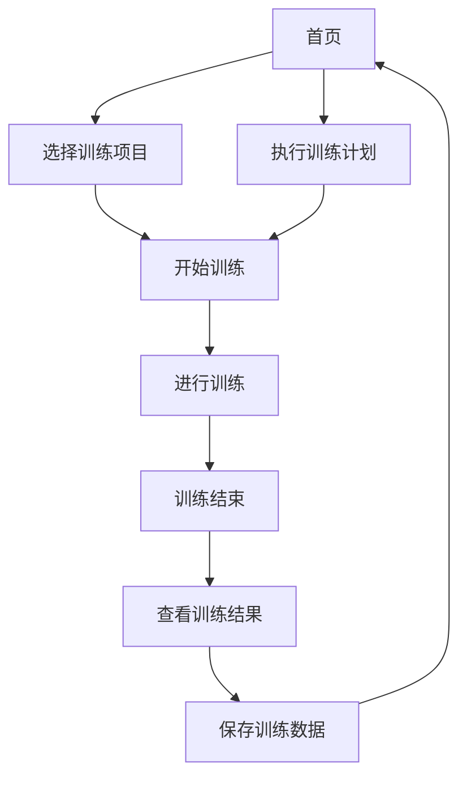
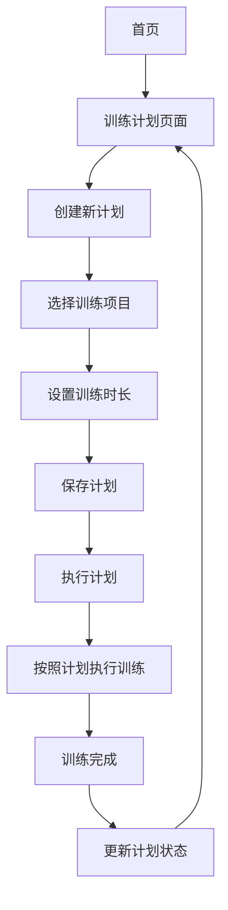

# 视力训练系统设计文档

## 1. 系统架构

### 1.1 整体架构

本项目采用纯前端架构，基于 HTML5、CSS3 和 JavaScript 实现，数据存储使用浏览器的 LocalStorage。系统由以下核心模块组成：

1. **核心训练模块**：包含各种视力训练项目的实现
2. **数据管理模块**：负责训练数据的存储、读取和管理
3. **用户界面模块**：提供统一的用户界面和交互体验
4. **计划管理模块**：负责训练计划的创建和执行

### 1.2 技术栈

| 技术 | 用途 |
|-----|-----|
| HTML5 | 页面结构 |
| CSS3 | 样式和响应式设计 |
| JavaScript | 交互逻辑和训练功能实现 |
| LocalStorage | 数据存储 |
| Chart.js | 数据可视化（用于训练数据分析） |

## 2. 页面结构

### 2.1 主要页面

| 页面名称 | 功能描述 | 文件路径 |
|---------|--------|--------|
| 首页 | 系统入口，展示所有训练项目 | index.html |
| Gabor 配对训练 | Gabor 图案配对训练 | gabor-match-pilot.html |
| 闪烁 Gabor 焦点锁定 | 闪烁 Gabor 图案焦点训练 | flicker-gabor-focus.html |
| 对比辨别 | 对比度辨别训练 | brightness-2afc.html |
| 阅读清晰度 | 阅读清晰度训练 | reading-2afc.html |
| 眩光/散射可视性 | 眩光条件下的可视性训练 | glare-2afc.html |
| 隧道远近切换识别 | 远近焦点切换训练 | tunnel-symbol-speed.html |
| 用户管理 | 用户信息管理 | auth.html |
| 训练计划 | 训练计划管理 | plans.html |
| 执行计划 | 执行训练计划 | execute-plan.html |
| 数据分析 | 训练数据分析 | analytics.html |
| 提醒设置 | 训练提醒设置 | reminders.html |
| 训练报告 | 训练报告生成 | reports.html |
| 数据同步 | 训练数据同步 | sync.html |
| 管理后台 | LocalStorage 数据管理 | admin.html |

### 2.2 通用组件

| 组件名称 | 功能描述 | 文件路径 |
|---------|--------|--------|
| 导航菜单 | 统一的导航菜单 | menu.js |

## 3. 核心功能实现

### 3.1 训练项目实现

#### 3.1.1 Gabor 配对训练

- **功能描述**：在网格中找出与金色提示格完全相同的另一格
- **实现原理**：
  - 生成随机的 Gabor 图案网格
  - 确保网格中只有两个完全相同的图案
  - 记录用户的选择和反应时间
  - 根据用户表现调整难度
- **关键参数**：
  - 网格大小（K值）：4×4 到 8×8
  - 难度级别：简单、中等、困难
  - 训练模式：固定难度、逐步升级

#### 3.1.2 其他训练项目

其他训练项目（闪烁 Gabor 焦点锁定、对比辨别、阅读清晰度、眩光/散射可视性、隧道远近切换识别）的实现原理类似，都是通过生成视觉刺激、记录用户反应、分析训练数据来实现训练功能。

### 3.2 数据管理

- **数据存储**：使用 LocalStorage 存储训练数据
- **数据结构**：
  ```javascript
  {
    ts: "2026-04-06T12:00:00.000Z", // 训练时间
    score: 15, // 得分
    mode: "auto", // 训练模式
    durationSec: 120, // 训练时长（秒）
    maxK: 6 // 最高网格大小
  }
  ```
- **数据管理**：通过管理后台页面查看和删除历史数据

### 3.3 响应式设计

- **实现方式**：使用 CSS 媒体查询和弹性布局
- **断点设置**：
  - 768px：平板设备
  - 480px：移动设备
  - 360px：小屏幕移动设备
- **布局调整**：
  - 桌面端：多列网格布局
  - 移动端：单列布局，调整字体大小和间距

### 3.4 统一界面设计

- **设计风格**：Apple 风格的极简设计
- **颜色方案**：
  - 背景色：#f5f5f7
  - 主文本色：#1d1d1f
  - 次要文本色：#86868b
  - 强调色：#0071e3
  - 卡片背景：#ffffff
  - 边框色：#d2d2d7
- **导航菜单**：统一的弹出式菜单，通过 menu.js 实现

## 4. 关键技术点

### 4.1 Gabor 图案生成

- **实现方法**：使用 Canvas API 绘制 Gabor 图案
- **参数控制**：
  - 方向（theta）
  - 空间频率（cycles）
  - 相位（phi）
  - 对比度（contrast）
  - 大小（cellSize）

### 4.2 响应式布局

- **实现方法**：使用 CSS Flexbox 和 Grid 布局
- **关键技术**：
  - 媒体查询（@media）
  - 弹性布局（flex）
  - 网格布局（grid）
  - 相对单位（rem, em, %）

### 4.3 数据可视化

- **实现方法**：使用 Chart.js 库
- **图表类型**：折线图（用于展示训练成绩趋势）
- **数据处理**：从 LocalStorage 读取数据，进行统计和分析

### 4.4 本地数据管理

- **实现方法**：使用 LocalStorage API
- **数据操作**：
  - 存储数据：localStorage.setItem()
  - 读取数据：localStorage.getItem()
  - 删除数据：localStorage.removeItem()
  - 清空数据：localStorage.clear()

## 5. 页面流程图

### 5.1 训练流程



### 5.2 计划管理流程



## 6. 性能优化

### 6.1 前端性能

- **资源优化**：
  - 内联关键 CSS
  - 减少 JavaScript 文件大小
  - 优化 Canvas 绘制性能
- **加载优化**：
  - 延迟加载非关键资源
  - 优化页面渲染路径

### 6.2 存储优化

- **数据结构优化**：使用简洁的数据结构，减少存储空间
- **数据清理**：定期清理过期数据，保持 LocalStorage 大小合理

## 7. 扩展性考虑

### 7.1 功能扩展

- **新训练项目**：可以通过添加新的 HTML 文件和相应的 JavaScript 逻辑来添加新的训练项目
- **数据分析**：可以扩展数据分析功能，提供更详细的训练报告和建议

### 7.2 技术扩展

- **后端集成**：可以添加后端服务器，实现数据同步和多设备访问
- **用户系统**：可以添加用户认证系统，支持多用户使用
- **云存储**：可以集成云存储服务，提供更可靠的数据存储

## 8. 测试策略

### 8.1 功能测试

- **训练项目测试**：测试各个训练项目的功能是否正常
- **数据管理测试**：测试数据存储和管理功能
- **响应式测试**：测试在不同屏幕尺寸下的显示效果

### 8.2 性能测试

- **加载速度测试**：测试页面加载速度
- **运行性能测试**：测试训练项目的运行性能
- **存储性能测试**：测试数据存储和读取性能

### 8.3 兼容性测试

- **浏览器兼容性**：测试在不同浏览器中的显示效果
- **设备兼容性**：测试在不同设备中的显示效果

## 9. 部署说明

### 9.1 部署环境

- **服务器**：任何支持静态文件的 web 服务器
- **依赖**：无特殊依赖，纯前端实现

### 9.2 部署步骤

1. 将所有文件上传到 web 服务器
2. 确保服务器配置正确，支持静态文件访问
3. 通过浏览器访问服务器地址即可使用系统

### 9.3 本地运行

1. 在项目目录中运行 `python3 -m http.server 8000`
2. 在浏览器中访问 `http://localhost:8000`

## 10. 维护说明

### 10.1 数据维护

- **定期备份**：定期备份 LocalStorage 中的数据
- **数据清理**：定期清理过期或无用的数据

### 10.2 功能维护

- **bug 修复**：及时修复发现的 bug
- **性能优化**：持续优化系统性能
- **功能更新**：根据用户反馈更新功能